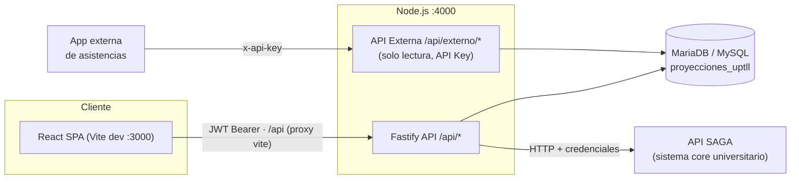
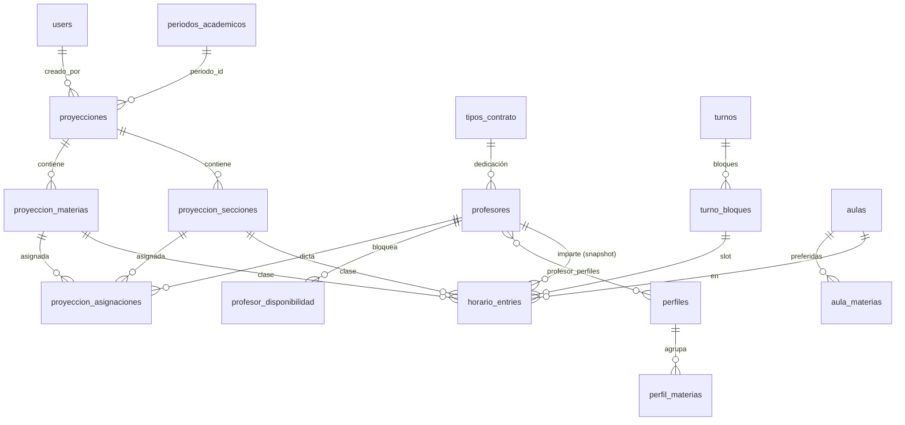
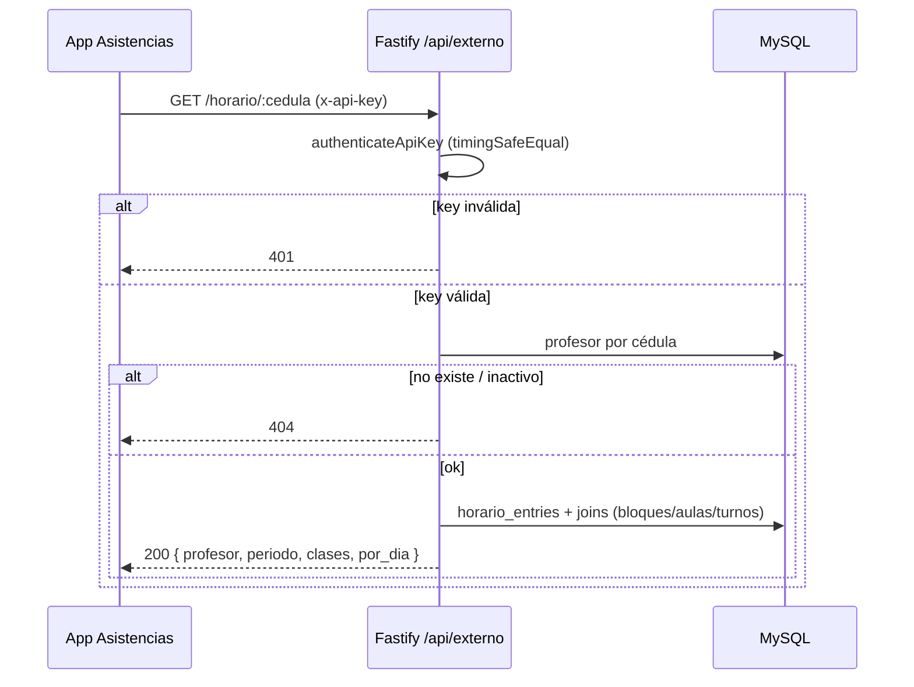

# Sistema de Proyecciones Académicas — UPTLL "Juana Ramírez"

Sistema web para la gestión de proyecciones académicas, carga docente y elaboración de horarios de la **Universidad Politécnica Territorial de los Llanos "Juana Ramírez"** (Extensión Altagracia de Orituco).

Permite crear proyecciones por PNF/trayecto, asignar profesores a unidades curriculares por sección y lapso, definir la disponibilidad docente, generar horarios automáticamente respetando conflictos de aula/sección/profesor, exportar reportes a Excel/PDF y exponer el horario de un docente a sistemas externos (app de asistencias).

> Documentos relacionados: [`SYSTEM_SPEC.md`](SYSTEM_SPEC.md) (especificación funcional), [`REGLAS_HORARIOS.md`](REGLAS_HORARIOS.md) (reglas del módulo de horarios) y [`docs/MANUAL_USUARIO.md`](docs/MANUAL_USUARIO.md) (manual de usuario con capturas — también disponible dentro de la app: menú ⚙ → **Ayuda**).

---

## 1. Arquitectura general



- **Frontend**: SPA en React servida por Vite en desarrollo (`:3000`); en producción se compila a `frontend/dist` y se sirve detrás del mismo origen/proxy.
- **Backend**: Fastify en `:4000`. Todo el API vive bajo `/api`. Archivos públicos (fotos de profesores) en `/public/`.
- **SAGA**: el backend actúa como proxy/cache hacia la API SAGA (programas, trayectos, turnos, docentes, pensum).
- **API externa**: prefijo `/api/externo`, autenticada por API key fija, **solo lectura**.

---

## 2. Stack tecnológico

| Capa | Tecnologías |
|---|---|
| Frontend | React 19, TypeScript 5.7, Vite 6, Tailwind CSS 4 (@tailwindcss/vite), lucide-react (iconos), @dnd-kit (drag & drop en grilla de horarios), exceljs (exportación Excel) |
| Backend | Node.js, Fastify 5, TypeScript, @fastify/jwt, @fastify/cors, @fastify/static, mysql2 (pool), bcryptjs (hash de contraseñas), tsx (dev con watch) |
| Base de datos | MariaDB / MySQL — InnoDB, utf8mb4 |
| Orquestación dev | `concurrently` en el package.json raíz |

---

## 3. Requisitos

- **Node.js** ≥ 18 (recomendado 20 LTS)
- **MariaDB ≥ 10.4** o **MySQL ≥ 8** accesible (local o remoto)
- Puerto **4000** libre (API) y **3000** (Vite dev)
- Credenciales de la **API SAGA** (opcional para desarrollo sin sincronización)

---

## 4. Variables de entorno

Archivo `backend/.env` (ver `backend/.env.example`):

| Variable | Default | Descripción |
|---|---|---|
| `PORT` | `4000` | Puerto del backend |
| `HOST` | `0.0.0.0` | Interfaz de escucha |
| `NODE_ENV` | `development` | Entorno Node |
| `JWT_SECRET` | *(inseguro por defecto)* | Secreto para firmar JWT. **Cambiar en producción** |
| `DB_HOST` / `DB_PORT` | `127.0.0.1` / `3306` | Host/puerto de MariaDB/MySQL |
| `DB_USER` / `DB_PASSWORD` | `root` / `''` | Credenciales de BD |
| `DB_NAME` | `proyecciones_uptll` | Nombre de la base de datos (se crea sola si no existe) |
| `API_URL` | `http://127.0.0.1:8000/api/v1` | URL base de la API SAGA |
| `API_USER` / `API_PASSWORD` | — | Credenciales SAGA |
| `EXTERNAL_API_KEY` | *(vacío = deshabilitado)* | Clave fija para `/api/externo`. Sin ella el endpoint responde 503. Generar una cadena larga y aleatoria |

El frontend **no necesita `.env`**: en dev el proxy de Vite redirige `/api` y `/public` → `127.0.0.1:4000` (este último sirve las fotos de profesores del backend). El manual de usuario es estático del propio frontend (`frontend/public/manual`, accesible en `/manual/index.html`).

---

## 5. Instalación y ejecución

```bash
# 1. Instalar dependencias (raíz, backend y frontend)
npm install
npm --prefix backend install
npm --prefix frontend install

# 2. Configurar backend/.env (copiar .env.example y ajustar)
cp backend/.env.example backend/.env

# 3. Levantar todo en desarrollo (backend :4000 + frontend :3000)
npm run dev
```

Scripts disponibles (raíz):

| Comando | Acción |
|---|---|
| `npm run dev` | Backend (tsx watch) + frontend (vite) en paralelo |
| `npm run dev:backend` | Solo backend, recarga en caliente |
| `npm run dev:frontend` | Solo frontend |
| `npm run build` | Compila backend (`tsc` → `dist/`) y frontend (`tsc && vite build`) |
| `npm run start:backend` | Producción: `node dist/server.js` |
| `npm --prefix backend run db:init` | Ejecuta migraciones/seed sin levantar el servidor |

**Inicialización automática**: al arrancar, `server.ts` ejecuta `initializeDatabase()` que crea la BD, las 21 tablas, índices, periodo inicial y el usuario `admin`/`admin123` (`SUPER_USUARIO`) si no existen. Las migraciones son idempotentes (`CREATE TABLE IF NOT EXISTS` + `ALTER` verificados vía `information_schema`).

**Verificar que todo corre**:

```bash
curl.exe http://localhost:4000/api/health
# {"status":"OK","system":"Proyecciones Académicas UPTLL Juana Ramírez","db":"up","timestamp":"..."}
```

Frontend: http://localhost:3000 — login con `admin / admin123`.

---

## 6. Estructura del proyecto

```
ProyeccionesRebuild/
├── package.json                  # scripts raíz (concurrently)
├── backend/
│   ├── .env / .env.example
│   └── src/
│       ├── server.ts             # bootstrap + initializeDatabase()
│       ├── app.ts                # buildApp(): plugins, /api/health, registro de módulos
│       ├── config/env.ts         # variables de entorno
│       ├── db/mysql.ts           # pool mysql2 + helper query()
│       ├── db/init.ts            # schema + migraciones idempotentes + seed
│       ├── plugins/
│       │   ├── authGuard.ts      # authenticate (JWT) + authorizeRoles
│       │   └── apiKeyGuard.ts    # authenticateApiKey (x-api-key / Bearer)
│       ├── modules/
│       │   ├── auth/             # login, profesor-login, me, logout
│       │   ├── saga/             # proxy a la API SAGA
│       │   ├── proyecciones/     # proyecciones + carga docente + asignaciones
│       │   ├── periodos/         # periodos académicos
│       │   ├── profesores/       # CRUD, foto, perfiles, disponibilidad, tipos de contrato
│       │   ├── perfiles/         # perfiles docentes
│       │   ├── usuarios/         # gestión de usuarios (SUPER_USUARIO)
│       │   ├── horarios/         # aulas, turnos, bloques, entries, generador
│       │   ├── reportes/         # plantillas de encabezado persistidas
│       │   └── externo/          # API de solo lectura (API key) para asistencias
│       └── utils/security.ts     # hashPassword / verifyPassword (bcryptjs)
└── frontend/
    └── src/
        ├── api/client.ts         # apiFetch() con Authorization Bearer
        ├── context/              # AuthContext, PnfColorContext
        ├── pages/                # vistas y modales (horarios/, reportes, etc.)
        └── utils/                # plantillas.ts, logo.ts, print.ts
```

**Convención**: imports TypeScript con extensión `.js` (`import ... from './x.js'`) por ESM.

---

## 7. Autenticación y roles

### JWT de usuarios (`/api/auth`)

| Endpoint | Acceso | Descripción |
|---|---|---|
| `POST /api/auth/login` | Público | `{username, password}` → `{token, user}`. Token 24h |
| `POST /api/auth/profesor-login` | Público | `{cedula}` → token de invitado 12h (`role: PROFESOR`, `invitado: true`, `id = -profesor.id`) |
| `GET /api/auth/me` | JWT | Datos del usuario autenticado |
| `POST /api/auth/logout` | — | Logout lógico (el frontend descarta el token) |

El frontend envía `Authorization: Bearer <token>` en cada request (ver `apiFetch` en `frontend/src/api/client.ts`).

### Roles

| Rol | Etiqueta UI | Alcance |
|---|---|---|
| `SUPER_USUARIO` | Master | Acceso total sin restricciones + gestión de usuarios |
| `ADMINISTRADOR` | Coordinador | Ve todo e imprime todo; escribe **solo en su PNF**. Requiere `pnf_saga_id` obligatorio — sin él, toda escritura acotada a PNF → 403 |
| `REGULAR` | Usuario | **Solo lectura** en todo el sistema |
| `PROFESOR` | Docente | Portal propio: solo lectura + editar **su propia** disponibilidad (`PUT /profesores/:id/disponibilidad` — el handler verifica que el id sea el suyo) |

Reglas específicas del **Coordinador** (`ADMINISTRADOR`), aplicadas en cada handler:

- **Periodos**: solo lectura — crear/editar/eliminar es exclusivo de Master.
- **Proyecciones**: crear/editar/activar/borrar solo con `pnf_saga_id` igual al suyo.
- **Horarios**: muta entries/genera/resuelve aulas solo de su PNF; la lectura de la grilla no se filtra.
- **Carga docente**: asigna solo materias de su PNF **a cualquier profesor**; puede *quitar* una materia de otro PNF únicamente cuando el profesor asignado es de su PNF.
- **Profesores**: crea/edita solo docentes de su PNF (los ve todos).
- **Catálogos globales** (aulas, turnos, tipos de contrato, perfiles docentes): editable por Master + Coordinador.
- **Color de PNF**: Master todos; Coordinador solo el suyo.
- **Reportes**: imprime cualquier reporte sin restricción; puede editar plantillas de encabezado.

Guards (`backend/src/plugins/authGuard.ts`): `authenticate` verifica el JWT; `authorizeRoles(...)` filtra por rol (ambos como `preHandler` por ruta); `esCoordinadorDeOtroPnf(user, pnf)` centraliza en los handlers la validación "Coordinador vs PNF ajeno" (true también cuando no tiene PNF).

---

## 8. Patrones de diseño

- **Modular monolith**: cada dominio es un módulo `modules/<x>/` con `routes.ts` (declaración + guards), `controller.ts` (handlers) y `service.ts` opcional (lógica pesada, ej. `scheduler.service.ts`).
- **Middleware/guards**: `preHandler` de Fastify para auth y autorización por ruta.
- **Repository simple**: helper `query<T>(sql, params)` sobre pool `mysql2/promise`; SQL parametrizado en todos los handlers.
- **Respuesta uniforme**: `{ success: boolean, message?: string, data?: any }`.
- **Migraciones auto-ejecutables**: `init.ts` en el arranque — sin herramienta externa de migraciones.
- **Frontend**: Context API (`AuthContext`, `PnfColorContext`), componentes de página + modales, guardado con debounce (plantillas de reporte ~800 ms), exportación cliente con exceljs + impresión HTML en iframe oculto.
- **Snapshot denormalizado**: `horario_entries.profesor_id` se sincroniza al cambiar la asignación (los horarios no se rompen al reasignar).

---

## 9. Esquema de base de datos

21 tablas (todas InnoDB, utf8mb4). Diagrama de relaciones principales:



### Catálogo de tablas

| Tabla | Propósito | Columnas clave |
|---|---|---|
| `users` | Usuarios del sistema | `username` UK, `password` (bcrypt), `role` ENUM, `pnf_saga_id`, `profesor_cedula`, `activo` |
| `pnf` | Programas Nacionales de Formación | `saga_id` UK, `nombre`, `codigo`, `color`, `tipo` (TRIMESTRAL/SEMESTRAL) |
| `trayectos` | Niveles académicos | `saga_id` UK, `nombre`, `orden` |
| `turnos` | Turnos de clase | `saga_id` UK NULL (local), `nombre`, `dias_semana` CSV 1–7, `horas_jornada`, `activo` |
| `turno_bloques` | Bloques horarios por turno | `turno_id` FK, `orden`, `hora_inicio`, `hora_fin`, `es_receso` — UK `(turno_id, orden)` |
| `periodos_academicos` | Periodos | `codigo` UK (`2026-1`), `nombre`, `fecha_inicio/fin`, `estado` (PLANIFICACION/ACTIVO/CERRADO) |
| `proyecciones` | Proyección PNF×trayecto×periodo | `codigo` UK, `periodo_id` FK, `pnf_saga_id`, `trayecto_saga_id`, `maya_id`, `periodo_academico`, `tipo_proyeccion`, `activa`, `creado_por` FK |
| `proyeccion_materias` | UCs de la proyección | `proyeccion_id` FK, `seccion_id` NULL = todas, `subject_saga_id`, `horas_semanales`, flags `q1..q3`, `semestre1/2`, `eliminada` |
| `proyeccion_secciones` | Secciones de la proyección | `proyeccion_id` FK, `nombre`, `turno_saga_id`, `turno_nombre`, `estudiantes_estimados`, `maya_id`, `congelada` |
| `aulas` | Aulas/laboratorios | `codigo` UK, `capacidad`, `tipo` ENUM (AULA_REGULAR…INSTALACION_DEPORTIVA), `pnf_saga_id`/`pnf_nombre` = PNF preferido |
| `aula_materias` | Materias preferidas por aula | PK `(aula_id, materia_nombre)` — por nombre normalizado |
| `tipos_contrato` | Dedicación docente | `saga_id` UK NULL, `nombre`, `horas_semanales` |
| `profesores` | Docentes | `cedula` UK, `saga_id`, `nombres/apellidos`, `pnf_saga_id`, `tipo_contrato_id` FK, `foto_url`, `origen` (SAGA/LOCAL), `activo` |
| `proyeccion_asignaciones` | Profesor por materia×sección×lapso | UK `(materia_id, seccion_id, trimestre)`; ausencia = sin asignar |
| `perfiles` | Perfiles docentes (afinidad) | `nombre` UK |
| `perfil_materias` | Materias de cada perfil | UK `(perfil_id, subject_saga_id)` |
| `profesor_perfiles` | Perfiles de cada profesor | PK `(profesor_id, perfil_id)` |
| `profesor_disponibilidad` | Slots **bloqueados** del docente | UK `(profesor_id, dia_semana, hora_inicio, hora_fin)` — ausencia = disponible |
| `horario_entries` | Una clase agendada | UK `(periodo, tipo, trimestre, dia, bloque, seccion)`; `profesor_id` snapshot; FKs a materia/sección/bloque/aula |
| `horario_config` | Reglas del generador (fila única id=1) | `min_horas_bloque`, `max_horas_dia`, `formato_12h` |
| `reportes_plantillas` | Encabezados editables de reportes | PK `reporte` (`horarios_seccion`, `horarios_aulas`, `horarios_profesores`, `carga_docente`), `encabezado` JSON |

> Reglas de conflicto/solape del horario (aula/sección/profesor por tiempo real, lapsos rivales, recesos, días hábiles del turno): ver [`REGLAS_HORARIOS.md`](REGLAS_HORARIOS.md).

---

## 10. API REST — catálogo de endpoints

Convención de auth: **JWT** = `Authorization: Bearer`; 🔒roles = `authorizeRoles` indicado.

### `/api/health` y estáticos

| Método | Ruta | Auth | Descripción |
|---|---|---|---|
| GET | `/api/health` | Público | `{status, db: up/down, timestamp}` — 503 si la BD cae |
| GET | `/public/*` | Público | Archivos estáticos (fotos de profesores) |

### `/api/auth`

| Método | Ruta | Auth | Descripción |
|---|---|---|---|
| POST | `/login` | Público | Login usuario → `{token, user}` |
| POST | `/profesor-login` | Público | Login docente por cédula → token invitado |
| GET | `/me` | JWT | Perfil de la sesión |
| POST | `/logout` | — | Logout lógico |

### `/api/saga` — proxy a la API SAGA (todos JWT)

| Método | Ruta | Descripción |
|---|---|---|
| GET | `/status` | Estado de conexión con SAGA (503 si cae) |
| GET | `/programas` | PNFs desde SAGA |
| GET | `/trayectos` | Trayectos |
| GET | `/turnos` | Turnos |
| GET | `/teachers` | Docentes |
| GET | `/mayas/:pnfSagaId` | Pensum/mallas del PNF |
| GET | `/materias-maya/:pnfSagaId/:mayaId` | UCs de una malla |
| GET | `/ucslist/:pnfSagaId/:trayectoSagaId/:mayaId` | UCs por trayecto |
| GET | `/inscriptions-summary/:pnfSagaId/:trayectoSagaId` | Resumen de inscripciones |

### `/api/proyecciones`

| Método | Ruta | Auth | Descripción |
|---|---|---|---|
| GET | `/carga-docente` | JWT | Matriz profesor×materia×sección×lapso del periodo |
| PUT | `/asignaciones` | ESCRITORES + regla PNF | Asignar/quitar profesor. Coord: solo asigna materias de su PNF (a cualquier docente); quita materias ajenas solo si el docente es suyo |
| POST | `/` | ESCRITORES + PNF | Crear proyección (Coord: solo de su PNF) |
| GET | `/`, `/:id` | JWT | Listar / detalle |
| PUT / DELETE | `/:id` | ESCRITORES + PNF | Editar / eliminar (Coord: solo su PNF) |
| PUT | `/:id/toggle-active` | ESCRITORES + PNF | Activar/desactivar (Coord: solo su PNF) |

### `/api/periodos`

| Método | Ruta | Auth | Descripción |
|---|---|---|---|
| GET | `/`, `/activos` | JWT | Listar todos / solo activos |
| POST | `/` | MASTER | Crear periodo |
| PUT / DELETE | `/:id` | MASTER | Editar / eliminar |

### `/api/profesores`

| Método | Ruta | Auth | Descripción |
|---|---|---|---|
| GET | `/`, `/:id` | JWT | Listar (`?para_asignacion=1&incluir_inactivos=1`) / detalle |
| POST | `/` | ESCRITORES + PNF | Crear profesor local (Coord: solo de su PNF) |
| PUT | `/:id` | ESCRITORES + PNF | Editar (Coord: solo su PNF) |
| PUT | `/:id/toggle-activo` | ESCRITORES + PNF | Activar/desactivar |
| PUT / DELETE | `/:id/foto` | ESCRITORES + PNF | Subir (base64, ≤3 MB) / borrar foto |
| POST | `/sync` | ESCRITORES | Sincronizar docentes desde SAGA |
| GET | `/:id/perfiles`, `/:id/perfiles-materias` | JWT | Perfiles del docente y sus materias afines |
| PUT | `/:id/perfiles` | ESCRITORES + PNF | Reemplazar perfiles (Coord: solo su PNF) |
| GET | `/:id/disponibilidad` | JWT | Slots bloqueados (PROFESOR: solo la propia) |
| PUT | `/:id/disponibilidad` | ESCRITORES + PROFESOR*(solo la propia)* | Marcar/desmarcar slot bloqueado (Coord: solo profesores de su PNF) |
| GET/POST/PUT/DELETE | `/tipos-contrato…` | GET: JWT · resto: ESCRITORES | CRUD de dedicaciones |
| POST | `/tipos-contrato/sync` | ESCRITORES | Sincronizar dedicaciones desde SAGA |

### `/api/perfiles`

| Método | Ruta | Auth | Descripción |
|---|---|---|---|
| GET | `/materias-catalogo` | JWT | Catálogo de materias para armar perfiles |
| GET | `/` | JWT | Listar perfiles |
| POST / PUT / DELETE | `/`, `/:id` | ESCRITORES | CRUD de perfiles |

### `/api/usuarios` — solo `SUPER_USUARIO`

| Método | Ruta | Descripción |
|---|---|---|
| GET | `/` | Listar usuarios |
| POST | `/` | Crear usuario (cualquier rol; rol Coordinador exige `pnf_saga_id`) |
| PUT | `/:id` | Editar usuario |
| PUT | `/:id/toggle-activo` | Activar/desactivar |

### `/api/horarios`

| Método | Ruta | Auth | Descripción |
|---|---|---|---|
| GET | `/aulas`, `/materias`, `/pnfs`, `/turnos`, `/config`, `/entries` | JWT | Catálogos y entries del lapso (`?periodo=&tipo=&trimestre=`) |
| POST/PUT/DELETE | `/aulas…` | ESCRITORES | CRUD de aulas (catálogo global) |
| PUT | `/pnfs/:sagaId/color` | ESCRITORES + PNF | Color del PNF en la UI (Coord: solo el suyo) |
| POST / DELETE | `/turnos`, `/turnos/:id` | ESCRITORES | Crear/eliminar turno |
| PUT | `/turnos/:id`, `/turnos/:id/bloques` | ESCRITORES | Editar turno / redefinir bloques |
| DELETE | `/turnos/:id/entries` | ESCRITORES + PNF | Borrar entries del turno (Coord: solo su PNF) |
| PUT | `/config` | ESCRITORES | Reglas del generador (`horario_config`) |
| PUT | `/entries` | ESCRITORES + PNF | Upsert de una clase — valida conflictos por tiempo real (Coord: solo su PNF) |
| POST | `/entries/swap`, `/move-group`, `/schedule-group`, `/unschedule`, `/aula-grupo`, `/resolver-aulas` | ESCRITORES + PNF | Operaciones de la grilla (Coord: solo su PNF) |
| DELETE | `/entries/:id` | ESCRITORES + PNF | Borrar una clase (Coord: solo su PNF) |
| POST | `/generar` | ESCRITORES + PNF | Generación automática del lapso (Coord: scopeada a su PNF) |

### `/api/reportes` — plantillas de encabezado

| Método | Ruta | Auth | Descripción |
|---|---|---|---|
| GET | `/plantilla/:reporte` | JWT | Plantilla guardada (`horarios_seccion`, `horarios_aulas`, `horarios_profesores`, `carga_docente`) |
| PUT | `/plantilla/:reporte` | ESCRITORES | Guardar plantilla (PROFESOR/REGULAR → 403) |

### `/api/externo` — integraciones (API key, solo lectura)

| Método | Ruta | Auth | Descripción |
|---|---|---|---|
| GET | `/horario/:cedula` | `x-api-key` | Horario del docente para la app de asistencias |

> Solo se registran métodos GET: no existe forma de escribir por este prefijo.

**Grupos de roles**: `ESCRITORES` = SUPER_USUARIO + ADMINISTRADOR (Coordinador) · `MASTER` = solo SUPER_USUARIO · `+ PNF` = el Coordinador además debe ser dueño del recurso (`esCoordinadorDeOtroPnf`). `REGULAR` (Usuario) y `PROFESOR` reciben 403 en toda escritura — salvo la disponibilidad propia del docente.

---

## 11. API externa de asistencias

Endpoint de **solo lectura** para que la app de asistencias consulte el horario de un docente.

### Autenticación

1. Definir en `backend/.env`:
   ```
   EXTERNAL_API_KEY=cadena_larga_aleatoria
   ```
2. Enviar la clave en cada request, por header:
   ```
   x-api-key: <clave>
   ```
   o alternativamente `Authorization: Bearer <clave>`.

La comparación usa `crypto.timingSafeEqual`. Sin clave configurada → **503**; clave ausente/inválida → **401**.

### Endpoint

```
GET /api/externo/horario/:cedula?periodo=&tipo=&trimestre=
```

| Param | Ubicación | Descripción |
|---|---|---|
| `cedula` | path (req.) | Cédula del docente |
| `periodo` | query | Código del periodo (`2026-1`); default: el ACTIVO |
| `tipo` | query | `TRIMESTRAL` o `SEMESTRAL` |
| `trimestre` | query | Nº de lapso (1–3 / 1–2) |

> Sin filtros devuelve **todos los lapsos** del periodo — la app debería filtrar por el lapso vigente, ej. `?tipo=TRIMESTRAL&trimestre=2`.

### Respuesta

```json
{
  "success": true,
  "data": {
    "profesor": { "id": 65, "cedula": "12118656", "nombres": "JOSE RAFAEL",
                  "apellidos": "ALMEA FUENTES", "pnf_nombre": "P.N.F. en Administración" },
    "periodo": "2026-1",
    "clases": [
      { "dia_semana": 1, "dia": "Lunes", "hora_inicio": "07:00", "hora_fin": "07:45",
        "materia": "PROYECTO SOCIO INTEGRADOR III", "materia_id": 146,
        "seccion": "M-01", "seccion_id": 26,
        "aula": "A6", "aula_nombre": "Aula 6", "turno": "Mañana",
        "tipo_proyeccion": "TRIMESTRAL", "trimestre": 1 }
    ],
    "por_dia": { "lunes": [ /* mismas clases agrupadas */ ], "martes": [] }
  }
}
```

`clases` viene ordenada por día + hora; `por_dia` agrupa las mismas entradas con claves en minúscula (`lunes`…`domingo`).

### Errores

| HTTP | Caso |
|---|---|
| 400 | Falta la cédula |
| 401 | API key ausente o inválida |
| 404 | Docente inexistente/inactivo, o sin periodo activo |
| 503 | `EXTERNAL_API_KEY` no configurada |

### Prueba rápida (PowerShell usa `curl.exe`)

```powershell
curl.exe "http://localhost:4000/api/externo/horario/12118656" -H "x-api-key: UPTLL_Altagracia_31416"
curl.exe "http://localhost:4000/api/externo/horario/12118656?tipo=TRIMESTRAL&trimestre=2" -H "x-api-key: UPTLL_Altagracia_31416"
```

### Flujo (diagrama de secuencia)



---

## 12. Verificación y pruebas

| Verificación | Comando |
|---|---|
| Typecheck backend | `npm --prefix backend run build` (o `cd backend && npx tsc --noEmit`) |
| Typecheck + build frontend | `npm --prefix frontend run build` |
| Health (incluye ping a BD) | `curl.exe http://localhost:4000/api/health` |
| Login smoke test | `curl.exe -X POST http://localhost:4000/api/auth/login -H "Content-Type: application/json" -d '{"username":"admin","password":"admin123"}'` |
| Externo sin key (espera 401) | `curl.exe http://localhost:4000/api/externo/horario/12118656` |

No hay suite de tests automatizados; la verificación es por typecheck + smoke tests + uso de la UI.

---

## 13. Troubleshooting

| Síntoma | Causa probable | Solución |
|---|---|---|
| `ECONNREFUSED` al arrancar backend | MariaDB/MySQL apagado o `DB_*` mal | Verificar servicio y `.env` |
| `503` en `/api/externo/*` | `EXTERNAL_API_KEY` vacía | Definirla en `backend/.env` y reiniciar |
| `503` en `/api/health` | BD caída | Revisar MariaDB/MySQL |
| `401` en `/api/*` | JWT ausente/expirado (24h) | Re-login |
| `403` en mutaciones | Rol insuficiente (ej. PROFESOR editando) | Esperado — solo lectura |
| Puerto 4000/3000 ocupado | Proceso previo vivo | `taskkill` / cambiar `PORT` |
| Frontend sin datos en dev | Backend no levantado | El proxy `/api` apunta a `127.0.0.1:4000` |
| Fotos de profesores rotas en dev | `/public/*` caía en el fallback SPA de Vite | Resuelto: `vite.config.ts` proxea `/public` → `:4000` |
| La app muestra otra aplicación en `:3000` | Service worker/caché de una app anterior en el mismo origen | DevTools → Application → "Clear site data" + Unregister del SW |
