# Manual de Usuario — Sistema de Proyecciones Académicas

**Universidad Politécnica Territorial de los Llanos "Juana Ramírez"**
*Extensión Altagracia de Orituco*

Manual dirigido a **coordinadores de PNF** y personal administrativo. No requiere conocimientos técnicos.

---

## Índice

1. [¿Qué es este sistema?](#1-qué-es-este-sistema)
2. [Cómo entrar al sistema](#2-cómo-entrar-al-sistema)
3. [Conociendo la pantalla](#3-conociendo-la-pantalla)
4. [Periodos académicos](#4-periodos-académicos)
5. [Crear una proyección](#5-crear-una-proyección)
6. [Gestión de profesores](#6-gestión-de-profesores)
7. [Carga docente (asignar profesores)](#7-carga-docente-asignar-profesores)
8. [Horarios](#8-horarios)
9. [Reportes, impresión y Excel](#9-reportes-impresión-y-excel)
10. [El portal del profesor](#10-el-portal-del-profesor)
11. [Preguntas frecuentes](#11-preguntas-frecuentes)

---

## 1. ¿Qué es este sistema?

Es la herramienta con la que la universidad organiza **qué materias se van a dictar, quién las dicta, en qué aula y a qué hora**, en cada periodo académico.

En resumen, el sistema le permite:

- Crear la **proyección** de su PNF (las materias y secciones que se ofrecerán en el periodo).
- Asignar **profesores** a cada materia y sección (la *carga docente*).
- Registrar la **disponibilidad** horaria de cada docente.
- Armar el **horario de clases** (a mano en una grilla, o de forma **automática** respetando aulas, turnos y disponibilidad).
- **Imprimir o exportar a Excel** los horarios y la carga docente, con el membrete institucional.

> 💡 **Consejo:** trabaje siempre con el *periodo activo*. El sistema muestra el periodo actual en la parte superior de cada pantalla.

---

## 2. Cómo entrar al sistema

1. Abra su navegador (Chrome, Edge o Firefox).
2. Escriba la dirección del sistema (la que le indique el administrador, por ejemplo `http://servidor:3000`).
3. Verá la pantalla de **Iniciar Sesión**. Escriba su **usuario** y **contraseña** y presione el botón **Iniciar Sesión**.

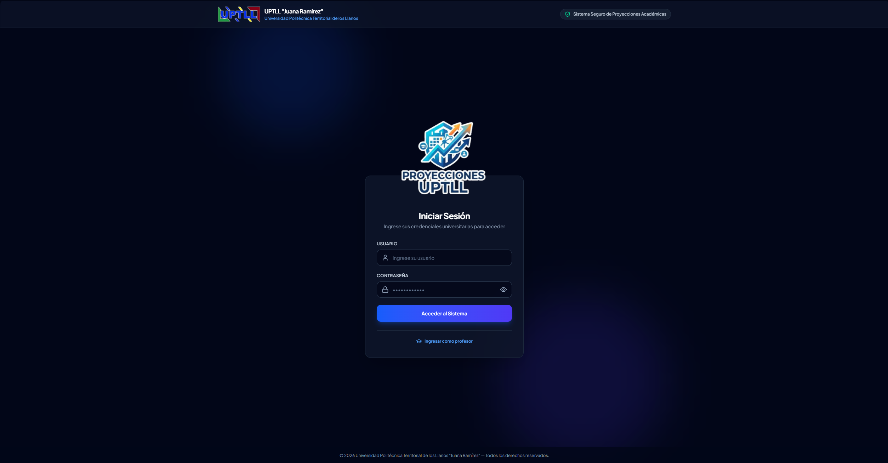

> ⚠️ **Si la contraseña falla:** verifique que no tenga activada la tecla de mayúsculas (Bloq Mayús) y vuelva a intentarlo. Si el problema continúa, solicite al administrador que restablezca su cuenta.

**Los profesores no usan usuario y contraseña**: en la misma pantalla hay un enlace **"Ingresar como profesor"** (Acceso Docente) donde solo escriben su número de cédula. Vea la sección [10. El portal del profesor](#10-el-portal-del-profesor).

---

## 3. Conociendo la pantalla

Al entrar verá la página principal. A la izquierda hay una **barra lateral** con las secciones del sistema:

| Sección | Para qué sirve |
|---|---|
| 🏠 **Inicio** | Resumen general del sistema |
| 📋 **Proyecciones** | Crear y administrar las proyecciones de cada PNF |
| 👤 **Profesores** | Lista de docentes, sus datos, perfiles y disponibilidad |
| 📊 **Carga Docente** | Asignar qué profesor dicta cada materia |
| 🗓️ **Horarios** | La grilla de clases: armar, mover y generar el horario |

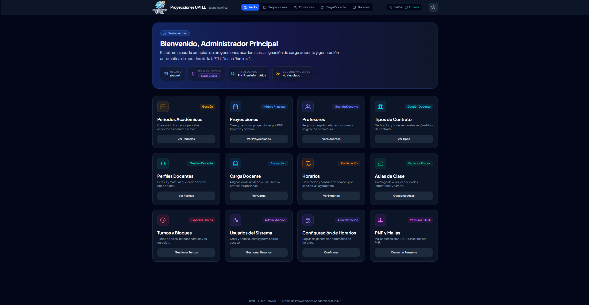

Botones que verá en casi todas las pantallas:

- **Actualizar** (icono de flechas circulares): vuelve a cargar los datos más recientes.
- **Reporte** o **Imprimir / Excel**: genera el documento para imprimir o descargar.
- Cuadro de **Buscar**: filtra la lista que está viendo (por nombre, cédula, materia…).

---

## 4. Periodos académicos

Un **periodo** es el lapso académico completo (por ejemplo *2026-2027*). Las proyecciones y horarios pertenecen a un periodo.

Para verlos, vaya a la pantalla de **Periodos Académicos** (desde el menú o la configuración). Allí puede:

- Ver todos los periodos y cuál está **ACTIVO**.
- Crear el periodo nuevo cuando inicie el año escolar.
- Cambiar el estado de un periodo (*PLANIFICACIÓN → ACTIVO → CERRADO*).

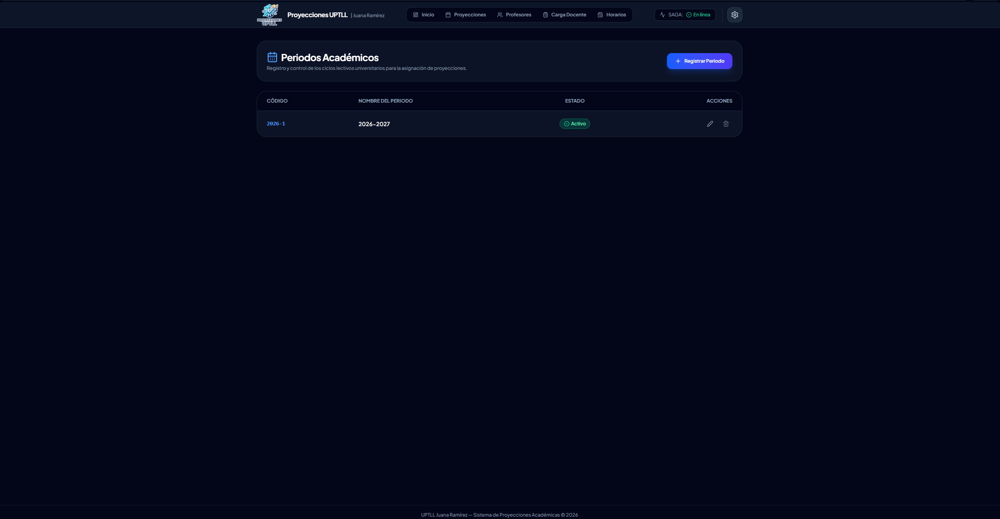

> ⚠️ **Importante:** solo debe haber **un** periodo ACTIVO a la vez. El horario y los reportes se generan sobre el periodo activo.

---

## 5. Crear una proyección

La **proyección** es la oferta académica de un trayecto de un PNF para el periodo: qué materias se dictarán y en cuántas secciones.

### Paso a paso

1. En la barra lateral, haga clic en **Proyecciones**.
2. Presione el botón **Nueva Proyección** (si es la primera vez, verá el botón **"Crear mi primera proyección"** en el centro de la pantalla).
3. En la ventana que se abre, seleccione:
   - **PNF** (el programa, por ejemplo *P.N.F. en Administración*).
   - **Trayecto** (Trayecto Inicial, I, II, III…).
   - **Malla / pensum** vigente.
   - El **tipo de régimen** (trimestral o semestral) — normalmente el sistema lo detecta según el PNF.
4. Marque las **materias** que se ofrecerán y defina las **secciones** (con su turno: Mañana, Tarde, Nocturno o Diurno).
5. Guarde. La proyección queda creada y **activa**.

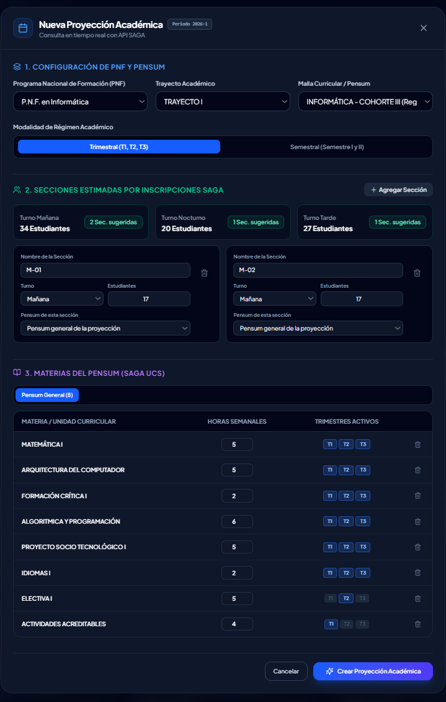

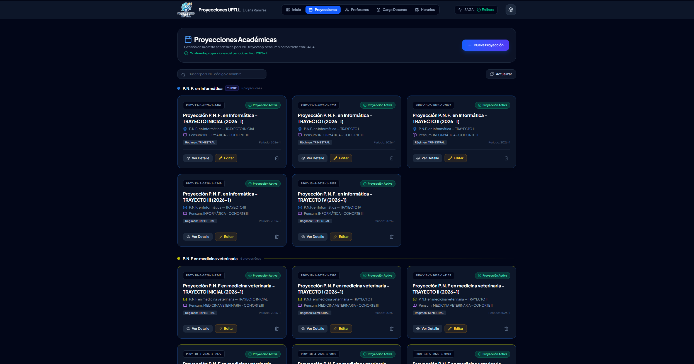

- Para **editar** una proyección: haga clic sobre ella en la lista.
- Si una proyección ya no se ofrecerá, puede **desactivarla** (no se borra la información).

> 💡 **Consejo:** los nombres de PNF, trayectos y materias vienen del sistema SAGA. Si una materia no aparece, verifique la sincronización (sección 6) o consulte al administrador.

---

## 6. Gestión de profesores

En la sección **Profesores** verá la lista de docentes con su foto, cédula, PNF y dedicación.

### Sincronizar con SAGA

El botón **"Sincronizar desde SAGA"** trae automáticamente los docentes registrados en el sistema central de la universidad. Úselo al inicio de cada periodo o cuando se incorpore personal nuevo.

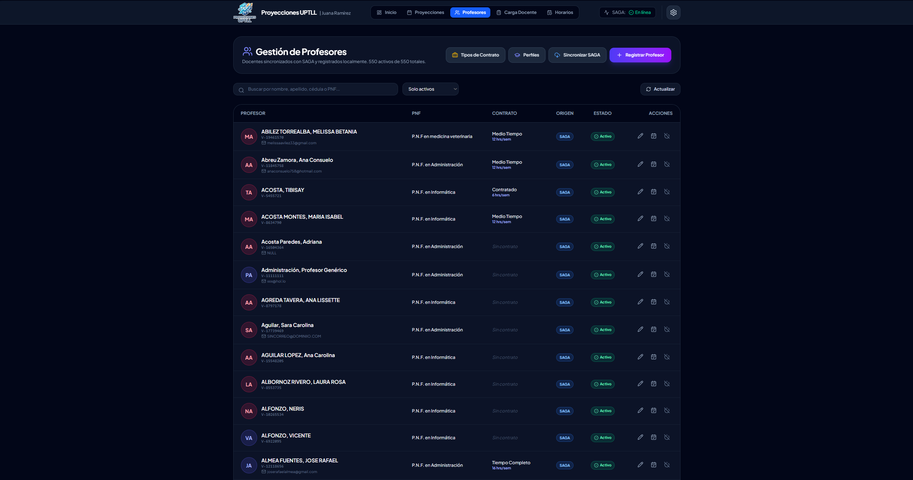

### Datos de un profesor

Haciendo **doble clic** sobre un profesor (o con los botones de su fila) puede:

- **Editar sus datos** (nombre, correo, teléfono, dedicación).
- **Asignarle un PNF** (importante para el filtro "Mis profesores").
- **Definir sus perfiles**: las áreas en las que puede dictar (ej. *Matemáticas*, *Informática*). Los perfiles sirven como **sugerencia** de afinidad al asignar materias.
- **Subir su foto**.
- **Registrar su disponibilidad**: marcar las horas en las que **no** puede dar clase (ver sección 8).
- **Desactivarlo** si ya no trabaja en la institución (no se borra su historial).

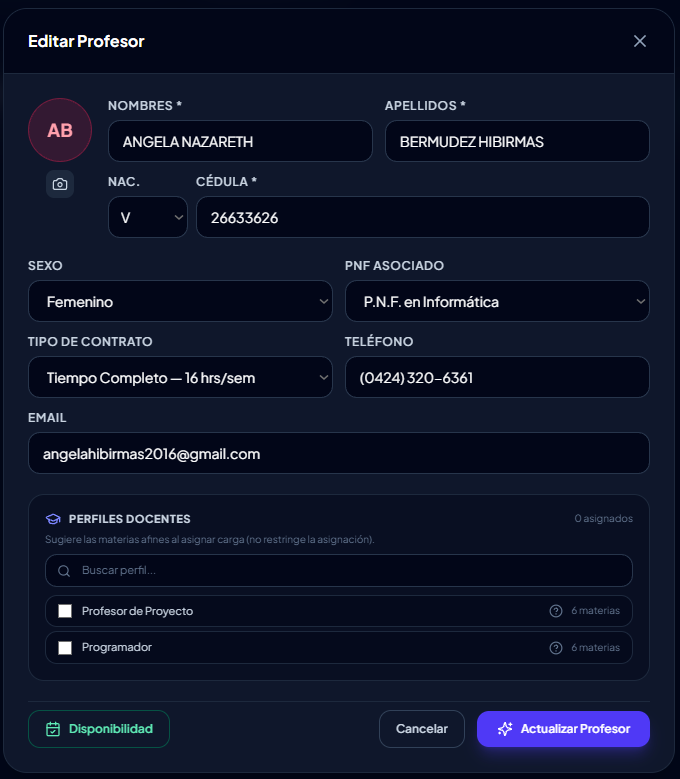

---

## 7. Carga docente (asignar profesores)

La pantalla **Carga Docente** es donde se decide **qué profesor dicta cada materia en cada sección y lapso**.

### La tabla

Cada fila es una materia de una sección. Las columnas de lapso (TRIMESTRE 1, TRIMESTRE 2…) muestran las **horas** de esa materia en cada lapso y el **total** de horas del profesor.

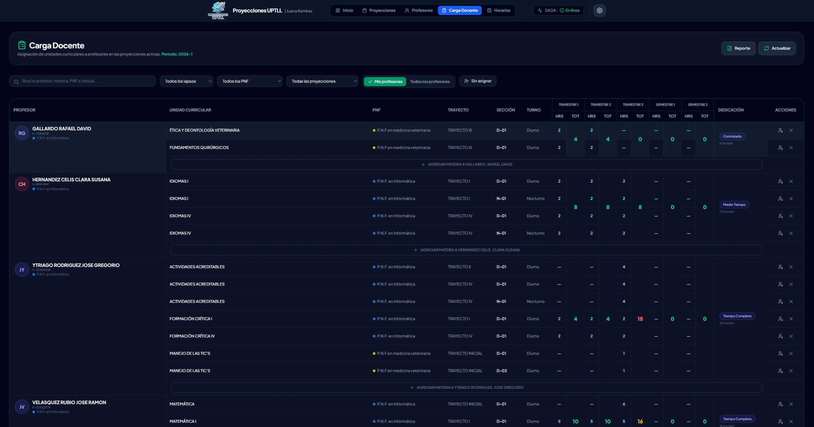

### Asignar o cambiar un profesor

1. Ubique la materia (puede usar el buscador o los filtros de arriba).
2. Presione el botón de **asignar** (icono de persona con lupa 🔍) en la fila.
3. Elija el profesor en la ventana y confirme.

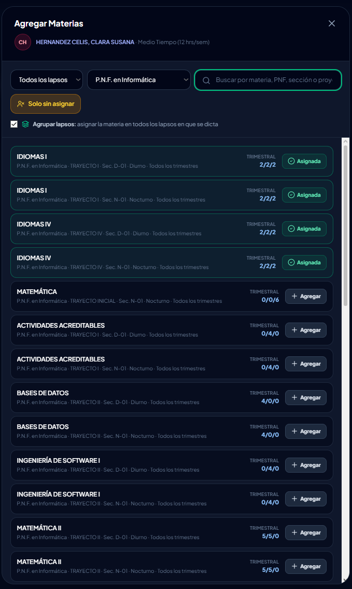

- Para **quitar** una asignación, use el botón ✖ de la fila.
- Las materias sin asignar aparecen en el bloque **"SIN ASIGNAR"** — y puede filtrar solo esas con el botón correspondiente.

### Filtros útiles (parte superior de la pantalla)

- **Lapso**: ver solo Trimestre 1, 2, 3 (o todos).
- **PNF** y **Proyección**: acotar por programa o trayecto.
- **Mis profesores**: muestra solo los docentes de su PNF.
- **Sin asignar**: muestra lo que falta por asignar.

### Colores del total de horas

El total semanal de cada profesor cambia de color según su dedicación (tipo de contrato):

- 🟢 **Verde**: dentro de su carga.
- 🟡 **Ámbar**: cerca del límite (80% o más).
- 🔴 **Rojo**: **sobrecargado** — tiene más horas de las que su contrato permite.

> ⚠️ Revise los totales en rojo antes de generar el horario.

---

## 8. Horarios

La sección **Horarios** es la grilla de clases: filas = bloques de hora, columnas = días de la semana.

### Cómo funciona la grilla

- Arriba elige el **lapso** (Trimestre 1, 2, 3 — o Semestre) y la **sección**.
- Cada materia pendiente por agendar aparece como una **tarjeta**; para ponerla en el horario, **arrástrela** con el mouse hasta el día y hora deseados.
- Para quitar una clase, arrástrela fuera o use su opción de desagendar.

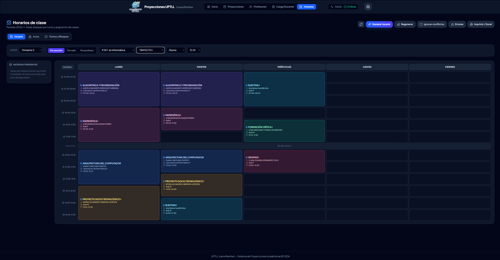

### Conflictos (el punto rojo)

Si una clase choca — porque el **aula**, el **profesor** o la **sección** ya tienen otra clase a esa hora — el sistema lo marca con un **punto rojo** y le avisa qué está en conflicto.

- Un bloque marcado **RECESO** no puede usarse.
- Los turnos **Mañana** y **Tarde** no chocan entre sí; el turno **Diurno** puede chocar con ambos (sus horas se solapan).
- Las materias sin profesor asignado también se pueden agendar.

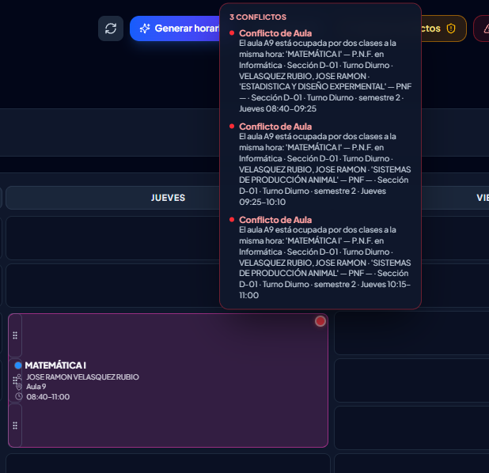

### Generar el horario automáticamente

El botón **"Generar horario"** agenda automáticamente las materias pendientes respetando:

- La **disponibilidad** de cada profesor.
- Los **conflictos** de aula, sección y profesor.
- Las reglas configurables (horas máximas por día, bloques contiguos mínimos, aulas preferidas del PNF…).

Hay dos opciones:

- **Generar horario**: completa lo que falta, sin tocar lo ya agendado.
- **Regenerar**: borra el horario del lapso y lo construye desde cero (pide confirmación).

Lo que no pudo agendarse queda en la lista de **pendientes** con el motivo.

### Turnos, bloques y aulas

- **Turnos y Bloques**: define las horas de clase de cada turno (ej. Mañana: 7:00–12:00 en bloques de 45 min) y qué días de la semana aplica.
- **Aulas**: catálogo de salones, laboratorios e instalaciones. Cada aula puede tener un **PNF preferido** y **materias preferidas** (el generador las prioriza, pero no es exclusivo).

### Ver por aula o por profesor

Además de la vista por sección, puede consultar las **agendas por aula** (qué clases ocupan cada salón) y **por profesor** (el horario semanal de cada docente). Útil para revisar ocupación antes de imprimir.

---

## 9. Reportes, impresión y Excel

Desde **Horarios** y desde **Carga Docente** hay un botón **"Imprimir / Excel"** (o **"Reporte"**) que abre la ventana de reporte.

### Generar el documento

1. Elija qué imprimir: **secciones**, **agendas de aulas** o **agendas de profesores**, y en qué lapsos.
2. Marque las casillas de lo que necesita.
3. Presione **Imprimir** (abre el diálogo de impresión del navegador — puede guardar como PDF) o **Excel** (descarga el archivo `.xlsx`).

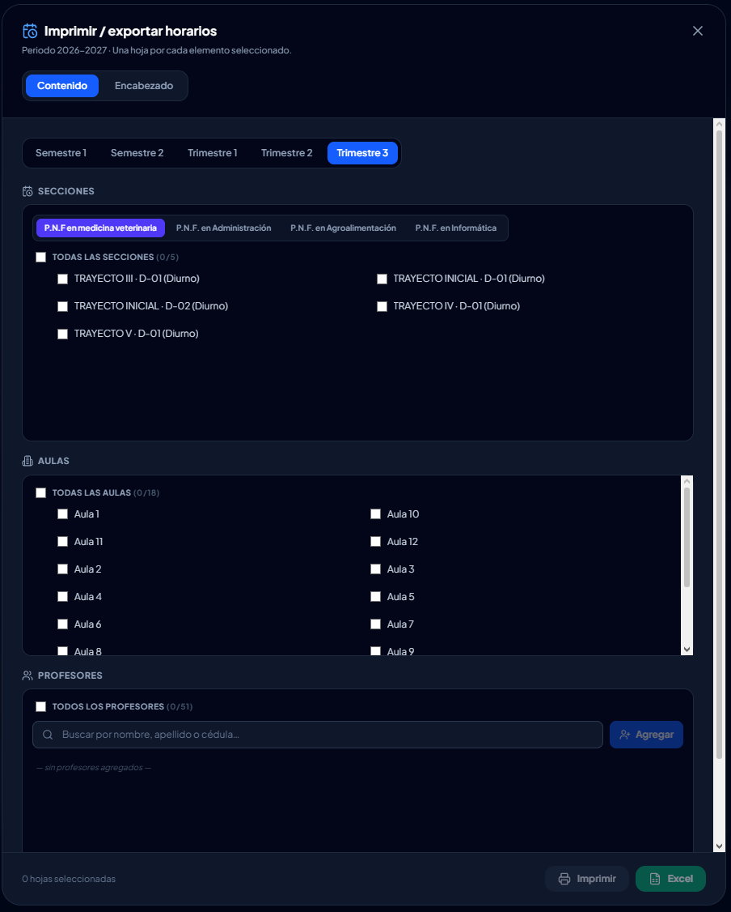

### Editar el encabezado (membrete)

Los reportes llevan un encabezado institucional (nombre de la universidad, título, periodo). Para cambiarlo:

1. En la ventana del reporte, abra la pestaña **"Encabezado"**.
2. Edite las líneas de texto. Puede usar **variables** que se reemplazan solas en cada hoja: `{SECCION}`, `{PROFESOR}`, `{AULA}`, `{LAPSO}`, `{PERIODO}`, `{PNF}`, `{PROGRAMA}`, `{TRAYECTO}`, `{TURNO}`.
3. **Se guarda automáticamente** al terminar de escribir — no hay botón de guardar.
4. **"Restaurar encabezado"** devuelve el texto original.

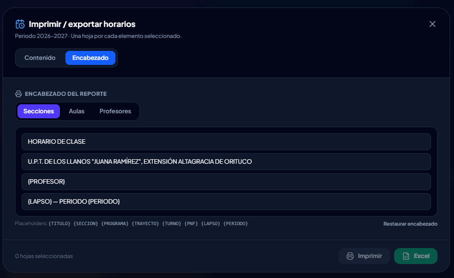

> ⚠️ El encabezado es **el mismo para todos los usuarios**: si usted lo cambia, cambia para todo el sistema. Los profesores no pueden editarlo.

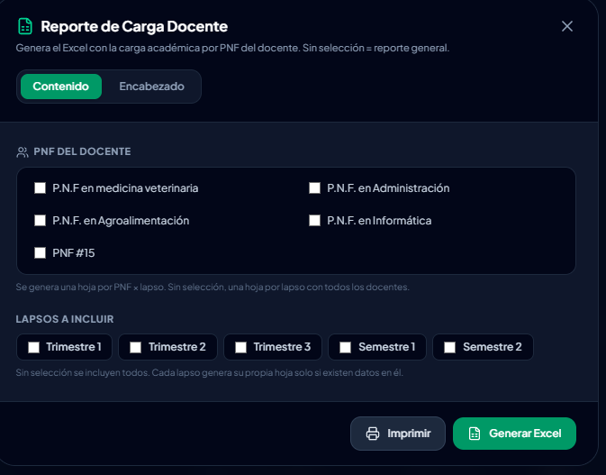

---

## 10. El portal del profesor

Los docentes **no tienen usuario ni contraseña** y no ven el panel de coordinación. Su acceso es así:

1. En la pantalla de inicio de sesión, haga clic en **"Ingresar como profesor"** (Acceso Docente).
2. Escriba su **número de cédula** (sin puntos ni guiones) y presione **Ingresar**.

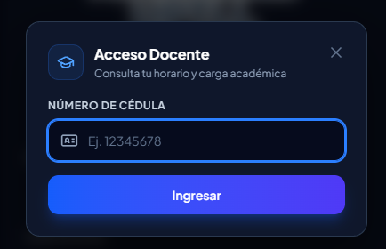

### Qué puede hacer el profesor

- **Ver sus materias** asignadas ("Mis Materias").
- **Ver e imprimir su horario** semanal.
- **Registrar su disponibilidad**: marcar en la grilla los horarios en los que **no puede** dar clase (reuniones, otros trabajos, etc.). Es **lo único que puede editar**.

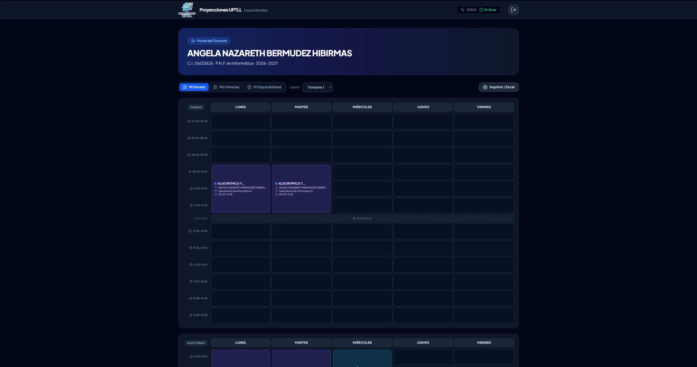

> ⚠️ **El profesor no puede** modificar proyecciones, asignaciones, horarios, encabezados de reportes ni ningún dato del sistema — solo su propia disponibilidad. Esto está bloqueado también a nivel de servidor.

### Por qué es importante la disponibilidad

El **generador automático** de horarios respeta la disponibilidad registrada: si el docente marcó que no puede los lunes, el sistema no le pondrá clase ese día. Pídales que la registren **antes** de generar el horario.

---

## 11. Preguntas frecuentes

**¿Por qué el sistema no me deja poner una clase a esa hora?**
Porque hay un conflicto: el aula, el profesor o la sección ya están ocupados en ese horario (aunque sea en otro turno con horas solapadas), o el bloque es un receso, o ese día no está habilitado para el turno. El mensaje de error le dice exactamente cuál es el choque.

**¿Se pierde mi trabajo si cierro la página?**
No. Todo lo que guarda (proyecciones, asignaciones, clases agendadas, disponibilidad, encabezados) queda en la base de datos del servidor inmediatamente.

**Generé el horario y quedaron materias pendientes. ¿Por qué?**
El generador muestra el motivo de cada una: normalmente falta de aulas libres, profesor sin disponibilidad en esos días, o que ya no quedan bloques contiguos. Ajuste disponibilidad/aulas y vuelva a generar (o agende esas a mano).

**¿Puedo mover una clase aunque haya conflicto?**
Sí, existe un modo que lo permite (el conflicto queda marcado con el punto rojo para resolverlo después). Úselo con cuidado.

**¿Cómo cambio el membrete de los reportes?**
Desde la ventana del reporte, pestaña **Encabezado** — se guarda solo (ver sección 9).

**El profesor dice que no puede entrar.**
Verifique que escribe la cédula **sin puntos ni letra inicial** y que su ficha está **activa** en la sección Profesores.

**¿Dónde veo qué aulas están libres?**
En Horarios, cambie a la vista de **agendas por aula**: cada salón muestra sus clases del lapso.

---

*Manual generado para el Sistema de Proyecciones Académicas UPTLL. Para soporte técnico contacte al administrador del sistema.*
